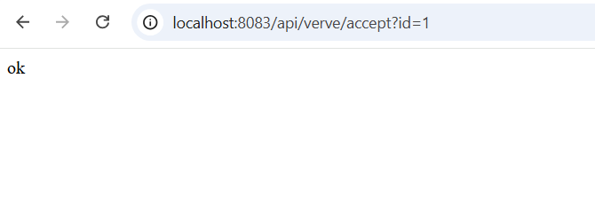
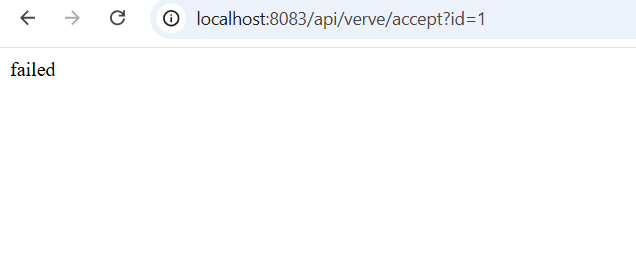
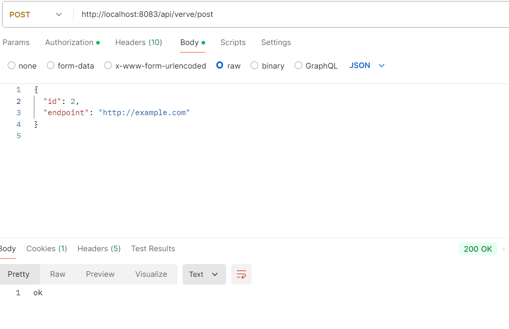
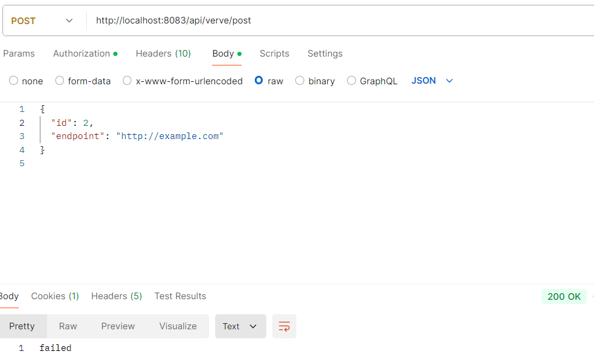
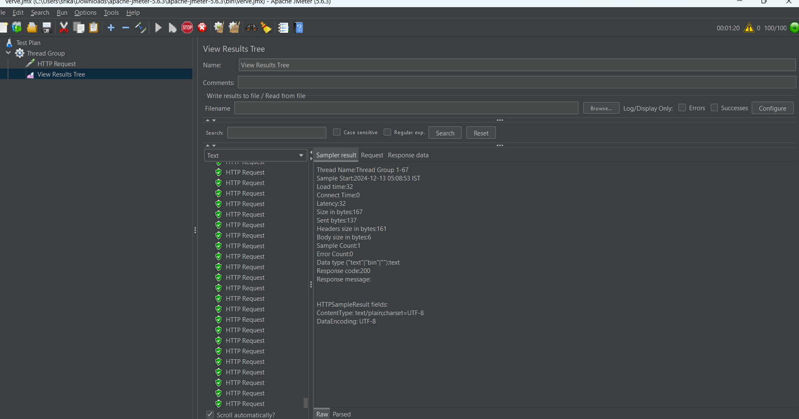

# verve

## Overview
This repository contains a Java application that implements a REST service designed to process at least 10K requests per second. The application exposes a single GET endpoint `/api/verve/accept` to handle incoming requests, while maintaining the integrity of request counts, uniqueness, and integration with external services.

The application handles the following tasks:
- Accepts an integer ID and an optional HTTP endpoint query parameter.
- Returns an "ok" response if the request is successfully processed, or "failed" if any error occurs.
- Logs unique requests every minute.

### Extensions:
1. **HTTP POST request**: Instead of firing an HTTP GET request, the service will send a POST request with a custom payload.
2. **Load Balancer and ID Deduplication**: Ensures id deduplication works even when the service is behind a load balancer, handling requests from multiple instances.

## Prerequisites
- **JDK 21** or higher
- **Maven** for project building
- **Docker** (optional for containerization)
- **Logging**: 
- **Distributed Streaming Service** : Apache Kafka and Redis

## How to Run

### Running the Application Locally:
1. **Clone the repository**:
   ```bash
   - git clone  https://github.com/SrikanthMidathapalli/verve.git
   - cd <project_directory>
   - mvn clean install
   - mvn spring-boot:run
   -  GET http://localhost:8083/api/verve/accept?id=123
```
### Output Example:
Below is an example output showing the request processing in action.












### Running the Application in Docker:
```bash
docker build -t verve-app .
docker run -p 8085:8080 verve-app
docker run -p 8082:8082 verve-app
```